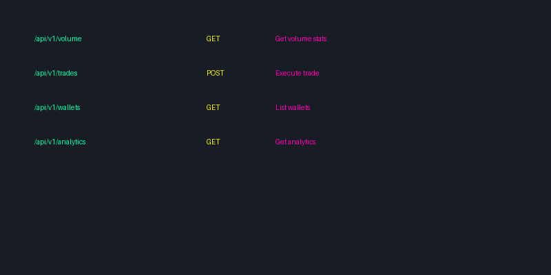

# API Reference Guide

<div align="center">
  
</div>

## 📚 API Overview

The Pump Fun Bot Suite provides a comprehensive API for managing trending optimization, volume generation, and bundle management. This guide details all available endpoints, methods, and configurations.

## 🔌 Core API

### Trending Bot API

#### Configuration
```typescript
interface TrendingBotConfig {
    // Basic Configuration
    trendingThreshold: number;      // Minimum trending score threshold
    trendingInterval: number;       // Check interval in milliseconds
    pumpFunApiKey: string;          // Pump.Fun API key
    discordWebhook?: string;        // Optional Discord webhook URL
    
    // Advanced Configuration
    minTrendingScore?: number;      // Minimum trending score target
    maxTrendingRank?: number;       // Maximum trending rank target
    volumeDistribution?: {          // Volume distribution settings
        buy: number;                // Buy volume ratio (0-1)
        sell: number;               // Sell volume ratio (0-1)
    };
    tradeFrequency?: {              // Trade frequency settings
        min: number;                // Minimum trades per hour
        max: number;                // Maximum trades per hour
    };
}

class PumpFunTrendingBot {
    constructor(config: TrendingBotConfig);
    
    // Core Methods
    start(): Promise<void>;
    stop(): Promise<void>;
    addToken(address: string): Promise<void>;
    removeToken(address: string): Promise<void>;
    
    // Monitoring Methods
    getMetrics(): Promise<Metrics>;
    getTrendingScore(): Promise<number>;
    getCurrentRank(): Promise<number>;
    
    // Configuration Methods
    updateConfig(config: Partial<TrendingBotConfig>): Promise<void>;
    setTrendingTarget(score: number): Promise<void>;
    setRankTarget(rank: number): Promise<void>;
    
    // Event Handlers
    on(event: 'trendingUpdate', handler: (data: TrendingUpdate) => void): void;
    on(event: 'rankUpdate', handler: (data: RankUpdate) => void): void;
    on(event: 'volumeUpdate', handler: (data: VolumeUpdate) => void): void;
}
```

### Volume Bot API

#### Configuration
```typescript
interface VolumeBotConfig {
    // Basic Configuration
    minVolume: number;              // Minimum volume target
    maxVolume: number;              // Maximum volume target
    interval: number;               // Check interval in milliseconds
    wallets: string[];              // List of wallet addresses
    
    // Advanced Configuration
    volumeDistribution?: {          // Volume distribution settings
        buy: number;                // Buy volume ratio (0-1)
        sell: number;               // Sell volume ratio (0-1)
    };
    tradeFrequency?: {              // Trade frequency settings
        min: number;                // Minimum trades per hour
        max: number;                // Maximum trades per hour
    };
    peakHours?: {                   // Peak hours settings
        start: string;              // Start time (HH:mm)
        end: string;                // End time (HH:mm)
    };
}

class PumpFunVolumeBot {
    constructor(config: VolumeBotConfig);
    
    // Core Methods
    start(): Promise<void>;
    stop(): Promise<void>;
    setVolume(target: number): Promise<void>;
    
    // Monitoring Methods
    getAnalytics(): Promise<Analytics>;
    getCurrentVolume(): Promise<number>;
    getTradeCount(): Promise<number>;
    
    // Configuration Methods
    updateConfig(config: Partial<VolumeBotConfig>): Promise<void>;
    setTradeFrequency(frequency: TradeFrequency): Promise<void>;
    setWalletLimits(limits: WalletLimits): Promise<void>;
    
    // Event Handlers
    on(event: 'volumeUpdate', handler: (data: VolumeUpdate) => void): void;
    on(event: 'tradeUpdate', handler: (data: TradeUpdate) => void): void;
    on(event: 'walletUpdate', handler: (data: WalletUpdate) => void): void;
}
```

### Bundler Bot API

#### Configuration
```typescript
interface BundlerBotConfig {
    // Basic Configuration
    maxBundleSize: number;          // Maximum bundle size
    minBundleSize: number;          // Minimum bundle size
    interval: number;               // Check interval in milliseconds
    
    // Advanced Configuration
    bundleStrategy?: {              // Bundle strategy settings
        type: 'optimize' | 'distribute' | 'custom';
        params: any;                // Strategy-specific parameters
    };
    antiMEV?: {                     // Anti-MEV settings
        enabled: boolean;           // Enable anti-MEV protection
        maxSlippage: number;        // Maximum allowed slippage
    };
}

class PumpFunBundlerBot {
    constructor(config: BundlerBotConfig);
    
    // Core Methods
    start(): Promise<void>;
    stop(): Promise<void>;
    createBundle(params: BundleParams): Promise<Bundle>;
    
    // Monitoring Methods
    getBundleStats(): Promise<BundleStats>;
    getMEVProtection(): Promise<MEVStats>;
    
    // Configuration Methods
    updateConfig(config: Partial<BundlerBotConfig>): Promise<void>;
    setBundleStrategy(strategy: BundleStrategy): Promise<void>;
    
    // Event Handlers
    on(event: 'bundleUpdate', handler: (data: BundleUpdate) => void): void;
    on(event: 'mevAlert', handler: (data: MEVAlert) => void): void;
}
```

## 📊 Data Types

### Common Types
```typescript
interface Metrics {
    trendingScore: number;
    currentRank: number;
    volume24h: number;
    tradeCount: number;
    successRate: number;
}

interface Analytics {
    volume: {
        current: number;
        target: number;
        growth: number;
    };
    trades: {
        count: number;
        success: number;
        failed: number;
    };
    performance: {
        efficiency: number;
        cost: number;
        roi: number;
    };
}

interface Bundle {
    id: string;
    size: number;
    cost: number;
    status: 'pending' | 'executed' | 'failed';
    transactions: Transaction[];
}

interface MEVStats {
    protected: number;
    saved: number;
    alerts: number;
}
```

## 🔄 Event Types

### Trending Events
```typescript
interface TrendingUpdate {
    score: number;
    rank: number;
    change: number;
    timestamp: number;
}

interface RankUpdate {
    rank: number;
    change: number;
    timestamp: number;
}

interface VolumeUpdate {
    volume: number;
    growth: number;
    timestamp: number;
}
```

### Volume Events
```typescript
interface TradeUpdate {
    count: number;
    success: number;
    failed: number;
    timestamp: number;
}

interface WalletUpdate {
    wallet: string;
    status: 'active' | 'cooldown' | 'error';
    tradeCount: number;
    timestamp: number;
}
```

### Bundle Events
```typescript
interface BundleUpdate {
    bundle: Bundle;
    status: string;
    timestamp: number;
}

interface MEVAlert {
    type: 'slippage' | 'frontrun' | 'sandwich';
    severity: 'low' | 'medium' | 'high';
    details: any;
    timestamp: number;
}
```

## 📝 Error Handling

### Error Types
```typescript
interface APIError {
    code: string;
    message: string;
    details?: any;
}

// Common error codes
const ERROR_CODES = {
    INVALID_API_KEY: 'E001',
    RATE_LIMIT_EXCEEDED: 'E002',
    INVALID_CONFIG: 'E003',
    WALLET_ERROR: 'E004',
    NETWORK_ERROR: 'E005',
    BUNDLE_ERROR: 'E006'
};
```

### Error Handling Example
```typescript
try {
    await bot.start();
} catch (error) {
    if (error instanceof APIError) {
        switch (error.code) {
            case ERROR_CODES.INVALID_API_KEY:
                console.error('Invalid API key');
                break;
            case ERROR_CODES.RATE_LIMIT_EXCEEDED:
                console.error('Rate limit exceeded');
                await bot.implementBackoff();
                break;
            default:
                console.error('Unknown error:', error.message);
        }
    }
}
```

## 📞 Support

Need help with the API? Contact us:
- [API Support](https://support.pumpfunvolume.bot/api)
- [Discord Community](https://discord.gg/pumpfun)
- [Documentation](https://docs.pumpfunvolume.bot)

## 🔄 Updates

This API reference is regularly updated with new features and improvements. Check back often for the latest API documentation. 