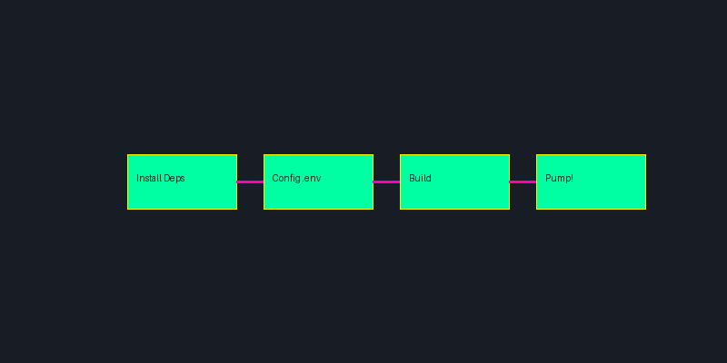

# Deployment Guide

<div align="center">
  
</div>

## 🚀 Deployment Overview

This guide will help you deploy the Pump Fun Bot Suite in various environments, from local development to production servers. Follow these steps to ensure a smooth deployment process.

## 📋 Prerequisites

### System Requirements
- Node.js 16.x or higher
- npm 7.x or higher
- TypeScript 4.x or higher
- Git
- 2GB RAM minimum
- 10GB storage minimum

### Required Accounts
- Pump.Fun API key
- Discord webhook URL (optional)
- GitHub account (for version control)

## 🛠️ Local Development Setup

### 1. Clone Repository
```bash
git clone https://github.com/A12RGA1645773/pump-fun-trending-bot.git
cd pump-fun-trending-bot
```

### 2. Install Dependencies
```bash
npm install
```

### 3. Configure Environment
```bash
# Copy example environment file
cp .env.example .env

# Edit .env file with your settings
nano .env
```

### 4. Build Project
```bash
npm run build
```

### 5. Start Development Server
```bash
npm run dev
```

## 🏗️ Production Deployment

### 1. Server Preparation

#### Update System
```bash
sudo apt update
sudo apt upgrade -y
```

#### Install Node.js
```bash
curl -fsSL https://deb.nodesource.com/setup_16.x | sudo -E bash -
sudo apt install -y nodejs
```

#### Install PM2
```bash
sudo npm install -g pm2
```

### 2. Application Deployment

#### Clone Repository
```bash
git clone https://github.com/A12RGA1645773/pump-fun-trending-bot.git
cd pump-fun-trending-bot
```

#### Install Dependencies
```bash
npm install
npm run build
```

#### Configure Environment
```bash
cp .env.example .env
nano .env
```

#### Start with PM2
```bash
pm2 start dist/index.js --name pump-fun-bot
```

### 3. PM2 Management

#### Basic Commands
```bash
# View running processes
pm2 list

# Monitor logs
pm2 logs pump-fun-bot

# Restart application
pm2 restart pump-fun-bot

# Stop application
pm2 stop pump-fun-bot
```

#### Auto-start Configuration
```bash
# Generate startup script
pm2 startup

# Save current process list
pm2 save
```

## 🔄 Continuous Deployment

### 1. GitHub Actions Setup

Create `.github/workflows/deploy.yml`:
```yaml
name: Deploy Pump Fun Bot

on:
  push:
    branches: [ main ]

jobs:
  deploy:
    runs-on: ubuntu-latest
    steps:
      - uses: actions/checkout@v2
      
      - name: Setup Node.js
        uses: actions/setup-node@v2
        with:
          node-version: '16'
          
      - name: Install Dependencies
        run: npm install
        
      - name: Build
        run: npm run build
        
      - name: Deploy to Server
        uses: appleboy/ssh-action@master
        with:
          host: ${{ secrets.SERVER_HOST }}
          username: ${{ secrets.SERVER_USER }}
          key: ${{ secrets.SSH_PRIVATE_KEY }}
          script: |
            cd /path/to/app
            git pull
            npm install
            npm run build
            pm2 restart pump-fun-bot
```

### 2. Environment Variables

Set up GitHub Secrets:
- `SERVER_HOST`: Your server IP
- `SERVER_USER`: SSH username
- `SSH_PRIVATE_KEY`: SSH private key

## 📊 Monitoring Setup

### 1. PM2 Monitoring

```bash
# Enable PM2 monitoring
pm2 install pm2-logrotate
pm2 set pm2-logrotate:max_size 10M
pm2 set pm2-logrotate:retain 7
```

### 2. Logging Configuration

```typescript
// src/config/logging.ts
export const loggingConfig = {
    level: 'info',
    format: 'json',
    rotation: {
        size: '10M',
        interval: '1d',
        compress: true
    }
};
```

### 3. Alert Setup

```typescript
// src/config/alerts.ts
export const alertConfig = {
    discord: {
        enabled: true,
        webhook: process.env.DISCORD_WEBHOOK_URL
    },
    email: {
        enabled: false,
        smtp: {
            host: process.env.SMTP_HOST,
            port: process.env.SMTP_PORT,
            auth: {
                user: process.env.SMTP_USER,
                pass: process.env.SMTP_PASS
            }
        }
    }
};
```

## 🔒 Security Configuration

### 1. Firewall Setup

```bash
# Allow SSH
sudo ufw allow ssh

# Allow Node.js application
sudo ufw allow 3000

# Enable firewall
sudo ufw enable
```

### 2. SSL Configuration

```bash
# Install Certbot
sudo apt install certbot

# Obtain SSL certificate
sudo certbot certonly --standalone -d yourdomain.com
```

### 3. Security Headers

```typescript
// src/config/security.ts
export const securityConfig = {
    headers: {
        'X-Frame-Options': 'DENY',
        'X-Content-Type-Options': 'nosniff',
        'Strict-Transport-Security': 'max-age=31536000',
        'Content-Security-Policy': "default-src 'self'"
    }
};
```

## 📈 Performance Optimization

### 1. Node.js Optimization

```bash
# Set Node.js flags
export NODE_OPTIONS="--max-old-space-size=2048"
```

### 2. PM2 Cluster Mode

```bash
# Start in cluster mode
pm2 start dist/index.js -i max --name pump-fun-bot
```

### 3. Memory Management

```typescript
// src/config/performance.ts
export const performanceConfig = {
    gc: {
        enabled: true,
        interval: 3600000 // 1 hour
    },
    memory: {
        maxHeapSize: 2048,
        maxOldSpaceSize: 2048
    }
};
```

## 🔍 Troubleshooting

### Common Issues

1. Memory Issues
```bash
# Check memory usage
pm2 monit

# Restart with more memory
pm2 restart pump-fun-bot --node-args="--max-old-space-size=2048"
```

2. Connection Issues
```bash
# Check network
netstat -tulpn | grep LISTEN

# Check logs
pm2 logs pump-fun-bot
```

3. Performance Issues
```bash
# Monitor CPU usage
top -p $(pgrep -f pump-fun-bot)

# Check disk space
df -h
```

## 📞 Support

Need help with deployment? Contact us:
- [Deployment Support](https://support.pumpfunvolume.bot/deployment)
- [Discord Community](https://discord.gg/pumpfun)
- [Documentation](https://docs.pumpfunvolume.bot)

## 🔄 Updates

This deployment guide is regularly updated with new features and best practices. Check back often for the latest deployment instructions. 