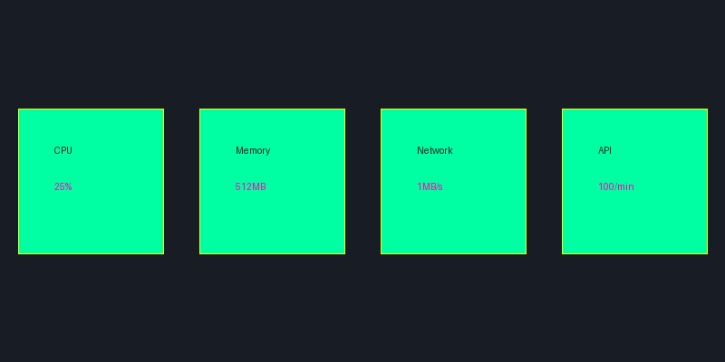

# Performance Optimization Guide

<div align="center">
  
</div>

## 🚀 Performance Optimization

This guide provides comprehensive strategies and best practices for optimizing your Pump Fun Bot Suite's performance. Follow these recommendations to maximize efficiency and achieve better results.

## 📊 System Optimization

### 1. Node.js Configuration

```bash
# Optimize Node.js memory
export NODE_OPTIONS="--max-old-space-size=2048 --optimize-for-size"

# Enable garbage collection
export NODE_OPTIONS="$NODE_OPTIONS --expose-gc"
```

### 2. PM2 Configuration

```bash
# Start in cluster mode
pm2 start dist/index.js -i max --name pump-fun-bot

# Configure PM2
pm2 set pump-fun-bot:max_memory_restart 1G
pm2 set pump-fun-bot:max_restarts 10
pm2 set pump-fun-bot:restart_delay 3000
```

### 3. System Resources

```bash
# Monitor system resources
pm2 monit

# Check memory usage
free -h

# Monitor CPU
top -p $(pgrep -f pump-fun-bot)
```

## 💰 Trading Optimization

### 1. Volume Distribution

```typescript
// Optimize volume distribution
const volumeConfig = {
    distribution: {
        buy: 0.6,
        sell: 0.4,
        variation: 0.05
    },
    timing: {
        peakHours: [9, 15, 21], // UTC
        minInterval: 300000, // 5 minutes
        maxInterval: 900000 // 15 minutes
    }
};

// Implement smart volume distribution
const distributeVolume = (totalVolume) => {
    const { buy, sell, variation } = volumeConfig.distribution;
    const randomVariation = (Math.random() - 0.5) * variation;
    return {
        buyVolume: totalVolume * (buy + randomVariation),
        sellVolume: totalVolume * (sell - randomVariation)
    };
};
```

### 2. Transaction Optimization

```typescript
// Optimize transaction settings
const txConfig = {
    gasLimit: 300000,
    maxPriorityFee: 2, // Gwei
    maxFee: 50, // Gwei
    nonceOffset: 0
};

// Implement transaction batching
const batchTransactions = async (transactions) => {
    const batchSize = 5;
    const batches = [];
    for (let i = 0; i < transactions.length; i += batchSize) {
        batches.push(transactions.slice(i, i + batchSize));
    }
    return Promise.all(batches.map(batch => Promise.all(batch)));
};
```

### 3. Wallet Management

```typescript
// Optimize wallet usage
const walletConfig = {
    maxWallets: 10,
    minBalance: 0.1, // ETH
    rotationInterval: 3600000 // 1 hour
};

// Implement wallet rotation
const rotateWallets = async () => {
    const activeWallets = await getActiveWallets();
    const availableWallets = await getAvailableWallets();
    const newWallets = availableWallets
        .filter(w => !activeWallets.includes(w))
        .slice(0, walletConfig.maxWallets - activeWallets.length);
    return [...activeWallets, ...newWallets];
};
```

## 📈 Trending Optimization

### 1. Score Optimization

```typescript
// Optimize trending score
const scoreConfig = {
    targetScore: 90,
    minScore: 80,
    updateInterval: 60000, // 1 minute
    strategies: {
        volume: 0.4,
        trades: 0.3,
        holders: 0.3
    }
};

// Implement score monitoring
const monitorScore = async () => {
    const currentScore = await getTrendingScore();
    if (currentScore < scoreConfig.minScore) {
        await adjustStrategies(currentScore);
    }
};
```

### 2. Trade Pattern Optimization

```typescript
// Optimize trade patterns
const patternConfig = {
    minTradesPerHour: 10,
    maxTradesPerHour: 50,
    tradeSizeVariation: 0.2,
    timeVariation: 0.3
};

// Implement pattern generation
const generateTradePattern = () => {
    const baseInterval = 3600000 / patternConfig.minTradesPerHour;
    const variation = baseInterval * patternConfig.timeVariation;
    return Array.from({ length: patternConfig.minTradesPerHour }, () => 
        baseInterval + (Math.random() - 0.5) * variation
    );
};
```

## 🔒 Security Optimization

### 1. Rate Limiting

```typescript
// Implement rate limiting
const rateLimitConfig = {
    maxRequests: 100,
    windowMs: 60000, // 1 minute
    delayMs: 1000
};

const rateLimiter = new Map();

const checkRateLimit = (key) => {
    const now = Date.now();
    const windowStart = now - rateLimitConfig.windowMs;
    const requests = rateLimiter.get(key) || [];
    const recentRequests = requests.filter(time => time > windowStart);
    rateLimiter.set(key, recentRequests);
    return recentRequests.length < rateLimitConfig.maxRequests;
};
```

### 2. Anti-Detection

```typescript
// Implement anti-detection measures
const antiDetectionConfig = {
    maxConcurrentTrades: 3,
    minDelayBetweenTrades: 30000, // 30 seconds
    maxDailyVolume: 1000000, // 1M USD
    walletRotation: true
};

// Implement trade obfuscation
const obfuscateTrade = (trade) => {
    const randomDelay = Math.random() * 10000;
    const randomAmount = trade.amount * (1 + (Math.random() - 0.5) * 0.1);
    return {
        ...trade,
        amount: randomAmount,
        delay: randomDelay
    };
};
```

## 📊 Monitoring Optimization

### 1. Logging Optimization

```typescript
// Optimize logging
const loggingConfig = {
    level: 'info',
    format: 'json',
    rotation: {
        size: '10M',
        interval: '1d',
        compress: true
    },
    filters: {
        exclude: ['debug', 'verbose'],
        include: ['error', 'warn', 'info']
    }
};

// Implement efficient logging
const log = (level, message, data) => {
    if (loggingConfig.filters.include.includes(level)) {
        console.log(JSON.stringify({
            timestamp: new Date().toISOString(),
            level,
            message,
            data
        }));
    }
};
```

### 2. Metrics Collection

```typescript
// Optimize metrics collection
const metricsConfig = {
    collectionInterval: 60000, // 1 minute
    retentionPeriod: 7 * 24 * 60 * 60 * 1000, // 7 days
    aggregation: {
        volume: 'sum',
        trades: 'count',
        score: 'avg'
    }
};

// Implement efficient metrics
const collectMetrics = async () => {
    const metrics = await Promise.all([
        getVolumeMetrics(),
        getTradeMetrics(),
        getScoreMetrics()
    ]);
    return aggregateMetrics(metrics, metricsConfig.aggregation);
};
```

## 🔧 Maintenance Optimization

### 1. Regular Maintenance

```bash
# Daily maintenance
pm2 monit
pm2 logs pump-fun-bot
df -h

# Weekly maintenance
npm audit
npm outdated
pm2 save

# Monthly maintenance
pm2 update
certbot renew
```

### 2. Performance Monitoring

```typescript
// Implement performance monitoring
const performanceConfig = {
    metrics: {
        cpu: true,
        memory: true,
        network: true,
        disk: true
    },
    alerts: {
        cpuThreshold: 80,
        memoryThreshold: 80,
        diskThreshold: 90
    }
};

// Monitor performance
const monitorPerformance = async () => {
    const metrics = await collectPerformanceMetrics();
    checkThresholds(metrics, performanceConfig.alerts);
};
```

## 📞 Support

Need help with optimization? Contact us:
- [Performance Support](https://support.pumpfunvolume.bot/performance)
- [Discord Community](https://discord.gg/pumpfun)
- [Documentation](https://docs.pumpfunvolume.bot)

## 🔄 Updates

This performance optimization guide is regularly updated with new strategies and best practices. Check back often for the latest optimization techniques. 