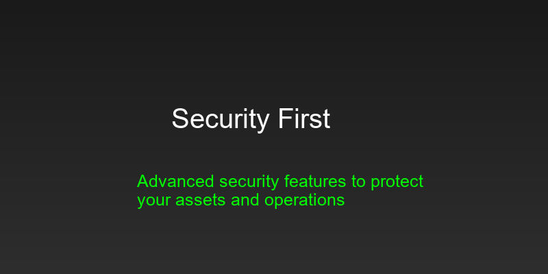

# Security Best Practices Guide

<div align="center">
  
</div>

## 🛡️ Security Overview

Security is paramount when operating trading bots. This guide outlines essential security practices to protect your assets and ensure safe operation of your Pump.Fun bots.

## 🔐 API Key Security

### Key Management
- Store keys in `.env` file
- Never commit keys to repository
- Rotate keys regularly
- Use key encryption

### Environment Setup
```bash
# .env file structure
PUMP_FUN_API_KEY=your_api_key_here
DISCORD_WEBHOOK_URL=your_webhook_url_here
WALLET_PRIVATE_KEY=your_wallet_key_here
```

### Key Rotation
```typescript
// Implement key rotation
const bot = new PumpFunBot({
    apiKey: process.env.PUMP_FUN_API_KEY,
    keyRotation: {
        interval: 86400000, // 24 hours
        backupKeys: ['backup_key_1', 'backup_key_2']
    }
});
```

## 💰 Wallet Security

### Wallet Management
- Use dedicated trading wallets
- Implement wallet limits
- Monitor wallet activity
- Regular balance checks

### Wallet Configuration
```typescript
// Configure wallet security
const bot = new PumpFunBot({
    wallets: [{
        address: 'wallet1',
        maxBalance: 1000,
        maxTrades: 100,
        cooldown: 3600
    }]
});
```

### Balance Monitoring
```typescript
// Monitor wallet balances
bot.on('balanceUpdate', (data) => {
    console.log(`Wallet: ${data.wallet}`);
    console.log(`Balance: ${data.balance}`);
    console.log(`Change: ${data.change}`);
});
```

## 🚫 Rate Limiting

### API Rate Limits
- Implement request throttling
- Monitor rate limits
- Handle rate limit errors
- Implement backoff strategy

### Rate Limit Configuration
```typescript
// Configure rate limiting
const bot = new PumpFunBot({
    rateLimits: {
        requestsPerMinute: 60,
        burstLimit: 10,
        backoffStrategy: 'exponential'
    }
});
```

### Error Handling
```typescript
// Handle rate limit errors
bot.on('rateLimitError', async (error) => {
    console.log('Rate limit reached, implementing backoff');
    await bot.implementBackoff();
});
```

## 🔍 Monitoring and Alerts

### Security Monitoring
- Monitor API activity
- Track wallet transactions
- Monitor rate limits
- Track error rates

### Alert Configuration
```typescript
// Configure security alerts
const bot = new PumpFunBot({
    alerts: {
        suspiciousActivity: true,
        rateLimitWarnings: true,
        balanceAlerts: true,
        errorNotifications: true
    }
});
```

### Alert Handlers
```typescript
// Handle security alerts
bot.on('securityAlert', (alert) => {
    console.log(`Security Alert: ${alert.type}`);
    console.log(`Details: ${alert.details}`);
    // Implement security response
});
```

## 🛡️ Anti-Detection Measures

### Trading Patterns
- Vary trade sizes
- Use random intervals
- Implement cooldowns
- Monitor patterns

### Pattern Configuration
```typescript
// Configure anti-detection
const bot = new PumpFunBot({
    antiDetection: {
        tradeVariation: 0.2,
        intervalRandomization: true,
        cooldownPeriods: true
    }
});
```

### Pattern Monitoring
```typescript
// Monitor trading patterns
bot.on('patternAlert', (data) => {
    console.log(`Pattern Alert: ${data.type}`);
    console.log(`Risk Level: ${data.riskLevel}`);
    // Adjust trading patterns
});
```

## 🔒 Error Handling

### Error Types
- API errors
- Network errors
- Transaction errors
- Rate limit errors

### Error Configuration
```typescript
// Configure error handling
const bot = new PumpFunBot({
    errorHandling: {
        retryAttempts: 3,
        retryDelay: 5000,
        fallbackStrategy: 'stop'
    }
});
```

### Error Handlers
```typescript
// Handle errors
bot.on('error', async (error) => {
    console.log(`Error: ${error.type}`);
    console.log(`Details: ${error.details}`);
    await bot.handleError(error);
});
```

## 📊 Logging and Auditing

### Log Configuration
- Enable detailed logging
- Implement log rotation
- Secure log storage
- Regular log analysis

### Log Setup
```typescript
// Configure logging
const bot = new PumpFunBot({
    logging: {
        level: 'info',
        rotation: 'daily',
        storage: 'secure'
    }
});
```

### Log Analysis
```typescript
// Analyze logs
const analysis = await bot.analyzeLogs({
    period: '24h',
    metrics: ['errors', 'warnings', 'security']
});
```

## 🚨 Emergency Procedures

### Emergency Stop
- Implement emergency stop
- Save current state
- Notify administrators
- Document incident

### Emergency Configuration
```typescript
// Configure emergency procedures
const bot = new PumpFunBot({
    emergency: {
        autoStop: true,
        notification: true,
        stateBackup: true
    }
});
```

### Emergency Handlers
```typescript
// Handle emergencies
bot.on('emergency', async (data) => {
    console.log('Emergency Situation Detected');
    await bot.emergencyStop();
    await bot.notifyAdministrators();
});
```

## 📝 Security Checklist

### Daily Checks
- [ ] Monitor API activity
- [ ] Check wallet balances
- [ ] Review error logs
- [ ] Verify rate limits

### Weekly Checks
- [ ] Rotate API keys
- [ ] Update security settings
- [ ] Review access logs
- [ ] Backup configurations

### Monthly Checks
- [ ] Security audit
- [ ] Update dependencies
- [ ] Review permissions
- [ ] Test emergency procedures

## 📞 Support

Need help with security? Contact us:
- [Security Support](https://support.pumpfunvolume.bot/security)
- [Discord Community](https://discord.gg/pumpfun)
- [Documentation](https://docs.pumpfunvolume.bot)

## 🔄 Updates

This guide is regularly updated with the latest security best practices. Check back often for new security recommendations and updates. 