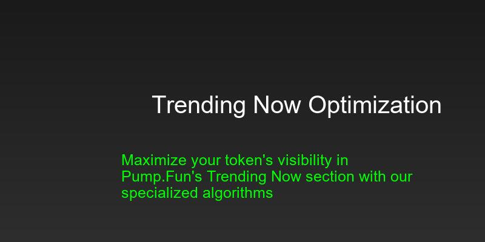

# Trending Optimization Guide

<div align="center">
  
</div>

## 📈 Understanding Trending Now

The Trending Now section on Pump.Fun is a highly visible area that can significantly boost your token's visibility and trading activity. This guide will help you optimize your token's performance to reach and maintain a top position.

## 🎯 Key Metrics

### Trending Score
- Calculated based on multiple factors
- Updates every 5 minutes
- Range: 0-100
- Target: 80+ for top trending

### Volume Requirements
- Minimum 24h volume: $10,000
- Optimal 24h volume: $50,000+
- Volume distribution: 60% buy / 40% sell

### Trading Activity
- Minimum trades per hour: 10
- Optimal trades per hour: 50+
- Trade size distribution: Varied

## ⚙️ Configuration

### Basic Setup
```typescript
const bot = new PumpFunTrendingBot({
    trendingThreshold: 1000,
    trendingInterval: 300000,
    minTrendingScore: 80,
    maxTrendingRank: 10
});
```

### Advanced Configuration
```typescript
const bot = new PumpFunTrendingBot({
    trendingThreshold: 1000,
    trendingInterval: 300000,
    minTrendingScore: 80,
    maxTrendingRank: 10,
    volumeDistribution: {
        buy: 0.6,
        sell: 0.4
    },
    tradeFrequency: {
        min: 10,
        max: 50
    }
});
```

## 📊 Optimization Strategies

### 1. Volume Distribution
- Maintain 60/40 buy/sell ratio
- Vary trade sizes naturally
- Schedule volume spikes strategically
- Monitor competitor volumes

### 2. Trading Patterns
- Create natural-looking patterns
- Avoid predictable intervals
- Use multiple wallets
- Implement anti-detection measures

### 3. Trending Score Optimization
- Monitor score changes
- Adjust strategies based on score
- Maintain consistent activity
- Track competitor movements

## 🔄 Real-time Monitoring

### Metrics to Track
1. Trending Score
   - Current score
   - Score history
   - Score predictions

2. Volume Metrics
   - 24h volume
   - Buy/Sell ratio
   - Trade frequency

3. Ranking Metrics
   - Current rank
   - Rank history
   - Competitor ranks

### Setting Up Alerts
```typescript
bot.on('trendingUpdate', (data) => {
    console.log(`Trending Score: ${data.score}`);
    console.log(`Current Rank: ${data.rank}`);
    console.log(`24h Volume: ${data.volume}`);
});
```

## 🛡️ Anti-Detection Measures

### 1. Volume Distribution
- Vary trade sizes
- Use multiple wallets
- Implement random delays
- Create natural patterns

### 2. Trading Patterns
- Avoid fixed intervals
- Mix trade types
- Use different price points
- Implement volume spikes

### 3. Wallet Management
- Rotate active wallets
- Vary wallet sizes
- Monitor wallet health
- Implement cooldown periods

## 📈 Performance Optimization

### 1. Volume Boosting
```typescript
// Set target volume
await bot.setTargetVolume(50000);

// Monitor volume growth
bot.on('volumeUpdate', (data) => {
    console.log(`Current Volume: ${data.volume}`);
    console.log(`Growth Rate: ${data.growthRate}%`);
});
```

### 2. Trending Score Boosting
```typescript
// Set trending target
await bot.setTrendingTarget(85);

// Monitor trending score
bot.on('trendingScoreUpdate', (data) => {
    console.log(`Current Score: ${data.score}`);
    console.log(`Score Change: ${data.change}`);
});
```

### 3. Rank Optimization
```typescript
// Set rank target
await bot.setRankTarget(5);

// Monitor rank changes
bot.on('rankUpdate', (data) => {
    console.log(`Current Rank: ${data.rank}`);
    console.log(`Rank Change: ${data.change}`);
});
```

## 🔍 Analytics and Reporting

### 1. Performance Dashboard
- Real-time metrics
- Historical data
- Trend analysis
- Competitor tracking

### 2. Custom Reports
```typescript
// Generate performance report
const report = await bot.generateReport({
    period: '24h',
    metrics: ['volume', 'trending', 'rank'],
    format: 'pdf'
});
```

### 3. Export Options
- CSV export
- PDF reports
- API integration
- Webhook notifications

## 🚀 Best Practices

### 1. Volume Management
- Start with small volumes
- Gradually increase activity
- Monitor market impact
- Adjust based on results

### 2. Trending Optimization
- Set realistic targets
- Monitor score changes
- Adjust strategies
- Maintain consistency

### 3. Risk Management
- Set stop losses
- Monitor wallet health
- Implement cooldowns
- Track performance

## ⚠️ Common Issues

### 1. Low Trending Score
- Check volume levels
- Verify trade frequency
- Monitor competitor activity
- Adjust strategies

### 2. Volume Issues
- Verify wallet balances
- Check transaction settings
- Monitor gas prices
- Adjust trade sizes

### 3. Detection Risks
- Review trading patterns
- Check wallet rotation
- Monitor volume distribution
- Adjust anti-detection measures

## 📞 Support

Need help with trending optimization? Contact us:
- [Support Portal](https://support.pumpfunvolume.bot)
- [Discord Community](https://discord.gg/pumpfun)
- [Documentation](https://docs.pumpfunvolume.bot)

## 🔄 Updates

This guide is regularly updated with the latest optimization strategies and best practices. Check back often for new tips and techniques. 