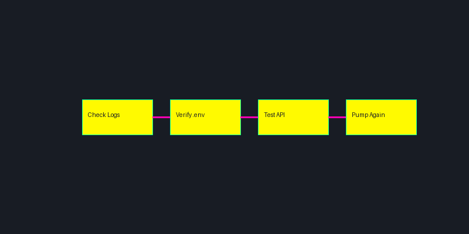

# Troubleshooting Guide

<div align="center">
  
</div>

## 🔍 Common Issues and Solutions

This guide provides solutions for common issues you might encounter while using the Pump Fun Bot Suite. Follow these steps to resolve problems and get your bot running smoothly.

## 🚫 Installation Issues

### 1. Node.js Version Mismatch

**Symptoms:**
- Installation fails
- Version compatibility errors
- Module not found errors

**Solution:**
```bash
# Check Node.js version
node -v

# Install correct version
nvm install 16
nvm use 16

# Clear npm cache
npm cache clean --force

# Reinstall dependencies
rm -rf node_modules
npm install
```

### 2. Missing Dependencies

**Symptoms:**
- Module not found errors
- Build failures
- Runtime errors

**Solution:**
```bash
# Install all dependencies
npm install

# Install specific missing dependency
npm install <package-name>

# Check for outdated packages
npm outdated

# Update packages
npm update
```

## 🔄 Runtime Issues

### 1. Bot Not Starting

**Symptoms:**
- Bot fails to start
- No error messages
- Process exits immediately

**Solution:**
```bash
# Check logs
pm2 logs pump-fun-bot

# Start with debug logging
DEBUG=* npm start

# Check environment variables
cat .env

# Verify configuration
node -e "console.log(require('./config'))"
```

### 2. Connection Issues

**Symptoms:**
- API connection errors
- Timeout errors
- Network errors

**Solution:**
```typescript
// Check API connection
const checkConnection = async () => {
    try {
        const response = await fetch('https://api.pump.fun/health');
        console.log('API Status:', response.status);
    } catch (error) {
        console.error('Connection Error:', error);
    }
};
```

### 3. Performance Issues

**Symptoms:**
- High CPU usage
- Memory leaks
- Slow response times

**Solution:**
```bash
# Monitor resources
pm2 monit

# Check memory usage
pm2 status

# Optimize Node.js
export NODE_OPTIONS="--max-old-space-size=2048"

# Restart with optimized settings
pm2 restart pump-fun-bot --node-args="--max-old-space-size=2048"
```

## 💰 Trading Issues

### 1. Volume Not Increasing

**Symptoms:**
- Low trading volume
- No volume growth
- Stagnant metrics

**Solution:**
```typescript
// Check volume configuration
const volumeConfig = {
    minVolume: 1000,
    maxVolume: 5000,
    interval: 300000, // 5 minutes
    wallets: 5
};

// Verify wallet balances
const checkBalances = async () => {
    for (const wallet of wallets) {
        const balance = await getBalance(wallet);
        console.log(`Wallet ${wallet}: ${balance}`);
    }
};
```

### 2. Trending Score Issues

**Symptoms:**
- Low trending score
- Not appearing in trending
- Score not improving

**Solution:**
```typescript
// Optimize trending configuration
const trendingConfig = {
    minScore: 80,
    targetScore: 90,
    updateInterval: 60000, // 1 minute
    strategies: ['volume', 'trades', 'holders']
};

// Monitor trending metrics
const monitorTrending = async () => {
    const metrics = await getTrendingMetrics();
    console.log('Trending Metrics:', metrics);
};
```

### 3. Transaction Failures

**Symptoms:**
- Failed transactions
- Gas errors
- Network congestion

**Solution:**
```typescript
// Implement retry mechanism
const executeTransaction = async (tx, maxRetries = 3) => {
    for (let i = 0; i < maxRetries; i++) {
        try {
            const result = await tx.send();
            return result;
        } catch (error) {
            console.error(`Attempt ${i + 1} failed:`, error);
            await new Promise(resolve => setTimeout(resolve, 1000 * (i + 1)));
        }
    }
    throw new Error('Max retries exceeded');
};
```

## 🔒 Security Issues

### 1. API Key Issues

**Symptoms:**
- Authentication errors
- Invalid key errors
- Rate limit errors

**Solution:**
```typescript
// Verify API key
const verifyApiKey = async () => {
    try {
        const response = await fetch('https://api.pump.fun/verify', {
            headers: {
                'Authorization': `Bearer ${process.env.API_KEY}`
            }
        });
        return response.ok;
    } catch (error) {
        console.error('API Key Error:', error);
        return false;
    }
};
```

### 2. Wallet Security

**Symptoms:**
- Unauthorized transactions
- Balance discrepancies
- Security alerts

**Solution:**
```typescript
// Implement wallet monitoring
const monitorWallets = async () => {
    for (const wallet of wallets) {
        const transactions = await getRecentTransactions(wallet);
        const suspicious = transactions.filter(tx => isSuspicious(tx));
        if (suspicious.length > 0) {
            alert(`Suspicious activity detected for wallet ${wallet}`);
        }
    }
};
```

## 📊 Monitoring Issues

### 1. Logging Problems

**Symptoms:**
- Missing logs
- Incomplete logs
- Log rotation issues

**Solution:**
```typescript
// Configure logging
const loggingConfig = {
    level: 'info',
    format: 'json',
    rotation: {
        size: '10M',
        interval: '1d',
        compress: true
    }
};

// Implement log rotation
pm2 install pm2-logrotate
pm2 set pm2-logrotate:max_size 10M
pm2 set pm2-logrotate:retain 7
```

### 2. Alert Issues

**Symptoms:**
- Missing alerts
- False positives
- Alert spam

**Solution:**
```typescript
// Configure alerts
const alertConfig = {
    thresholds: {
        volume: 1000,
        score: 80,
        errors: 5
    },
    cooldown: 300000, // 5 minutes
    channels: ['discord', 'email']
};

// Implement alert throttling
const sendAlert = async (message, type) => {
    const key = `${type}_${Date.now()}`;
    if (!alertCache.has(key)) {
        await sendNotification(message);
        alertCache.set(key, true);
        setTimeout(() => alertCache.delete(key), alertConfig.cooldown);
    }
};
```

## 🔧 Maintenance

### 1. Regular Checks

```bash
# Daily checks
pm2 monit
pm2 logs pump-fun-bot
df -h

# Weekly checks
npm audit
npm outdated
pm2 save

# Monthly checks
pm2 update
certbot renew
```

### 2. Backup Procedures

```bash
# Backup configuration
cp .env .env.backup
cp config.json config.json.backup

# Backup logs
tar -czf logs_backup.tar.gz logs/

# Backup database
pg_dump -U postgres pump_fun_bot > db_backup.sql
```

## 📞 Support

Need help? Contact us:
- [Technical Support](https://support.pumpfunvolume.bot)
- [Discord Community](https://discord.gg/pumpfun)
- [Documentation](https://docs.pumpfunvolume.bot)

## 🔄 Updates

This troubleshooting guide is regularly updated with new solutions and best practices. Check back often for the latest troubleshooting information. 